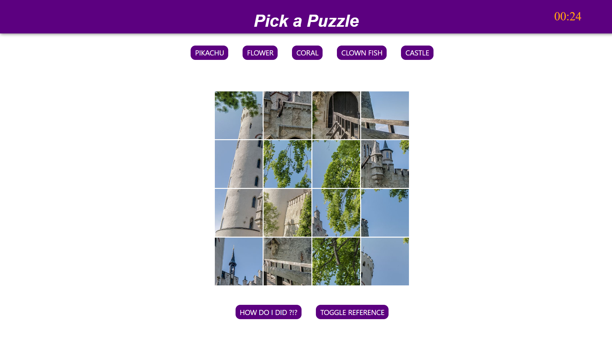

# Picture-Puzzles
This project is a simplistic one born from my love of puzzles. I hope you enjoy playing around in it as much as I enjoyed making it !!!

### Getting Started

link to project here: 

https://picture-puzzles.herokuapp.com/

### About

This is an app that allows the user to pick from several choices of puzzles to attempt. Upon picking a picture, that picture will be split into 16 slices. Each slice can be dragged to other slots to swap places. The timer will start once the first piece is moved. Once you believe that all of the pieces are in the correct location, click on the CHECK button to see how you did. ENJOY !!

### Technologies Used

| Technology | Use |
| --- | --- | 
Javascript | programming language |
nodejs | used for backend js |
css | styling html |

 
